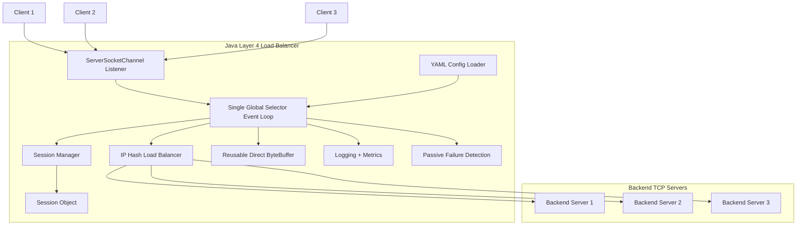
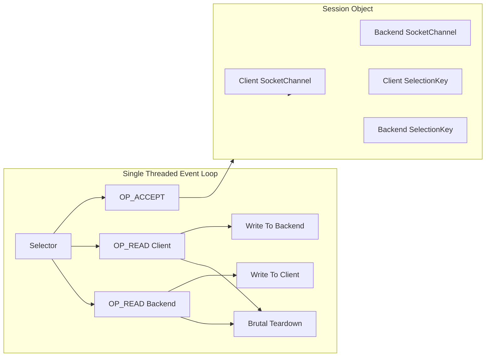
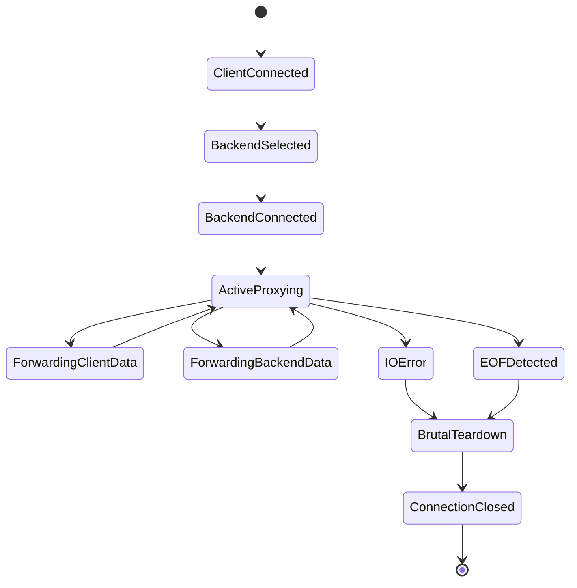
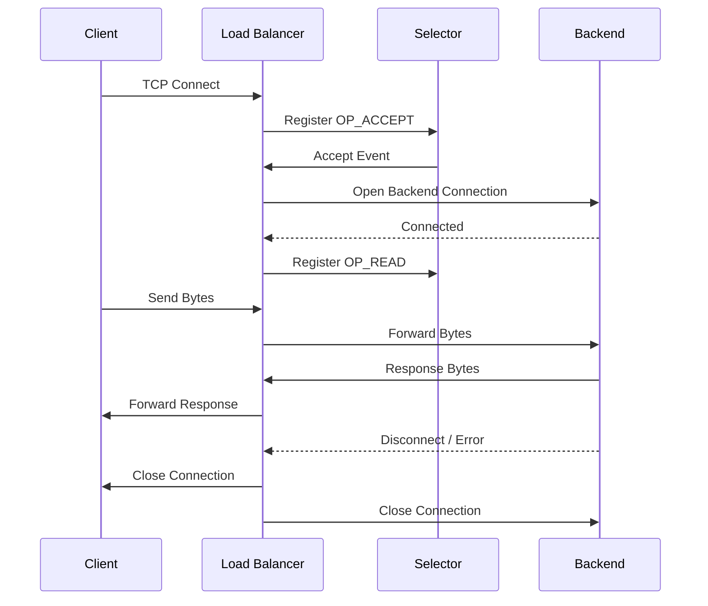
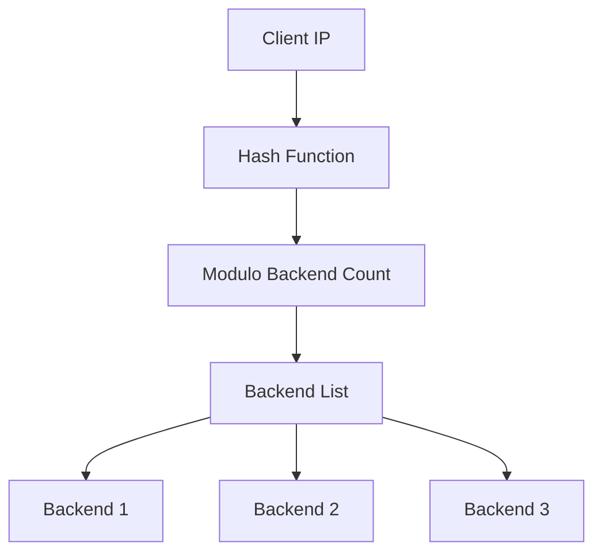
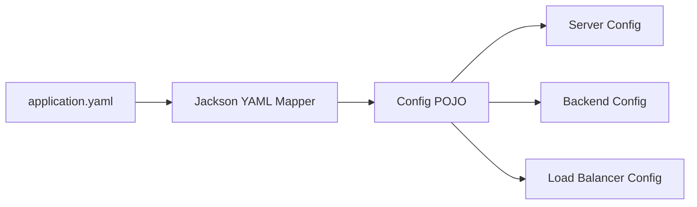
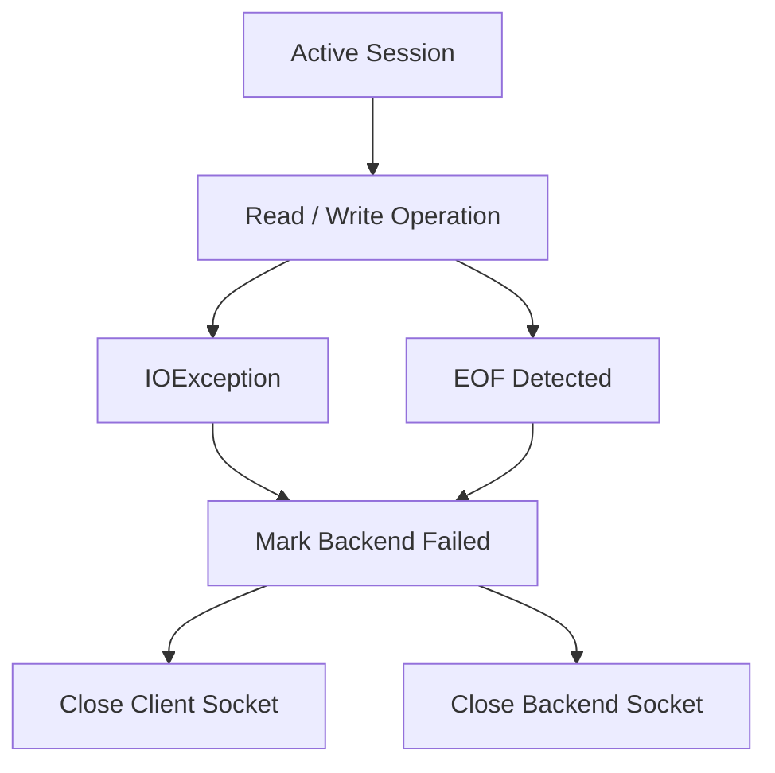
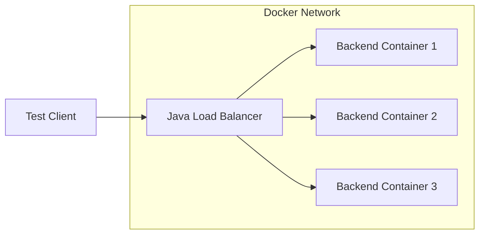

Paste the following diagrams directly into the Mermaid Live Editor.

---

# 1. Overall System Architecture

---

# 2. Internal Load Balancer Architecture

---

# 3. TCP Connection Lifecycle

---

# 4. Selector Event Flow

---

# 5. IP Hash Backend Selection

---

# 6. YAML Configuration Mapping

---

# 7. Passive Failure Detection

---

# 8. Docker Testing Topology

Useful Mermaid references:

* [Official Mermaid Docs](https://mermaid.ai/docs/mermaid-oss/intro/index.html)
* [Mermaid Live Editor](https://mermaid.live)
* [Mermaid Editor with Templates](https://mermaideditor.app/)
